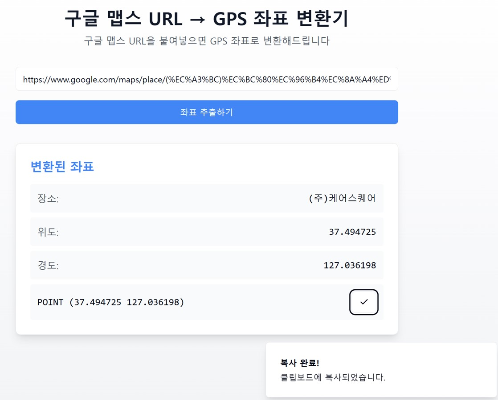

# 구글 맵스 URL → GPS 좌표 변환기



```sh
# Step 1: Clone the repository using the project's Git URL.
git clone https://github.com/doscode-kr/gps-to-point.git

# Step 2: Navigate to the project directory.
cd gps-to-point

# Step 3: Install the necessary dependencies.
npm i

# Step 4: Start the development server with auto-reloading and an instant preview.
npm run dev
```

## What technologies are used for this project?

This project is built with .

- Vite
- TypeScript
- React
- shadcn-ui
- Tailwind CSS

 